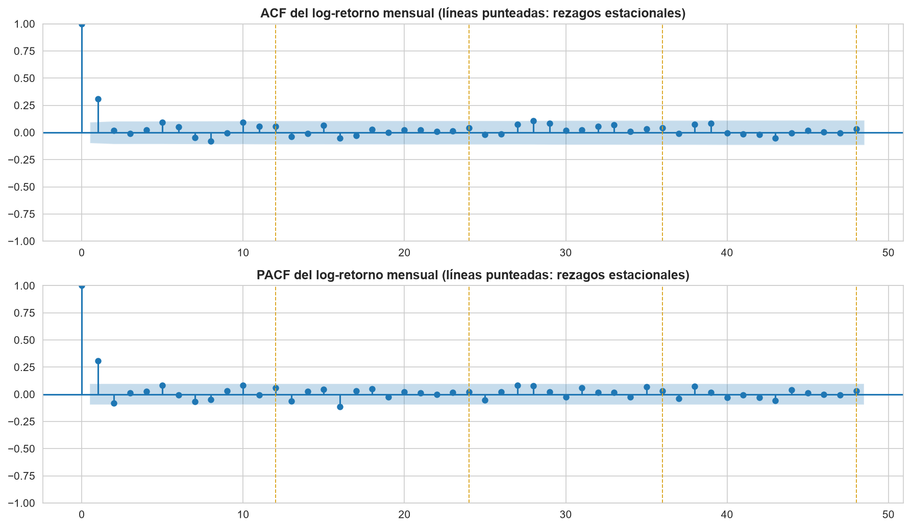

# Series de tiempo de la TRM en Colombia

Análisis de la **Tasa Representativa del Mercado (TRM)** del peso colombiano frente al dólar, entre 1991 y 2026, con la metodología Box-Jenkins. El proyecto se desarrolla por etapas en la electiva de Series de Tiempo de la Especialización en Analítica Estadística de la Universidad de La Salle. Cada etapa queda documentada en su propio notebook, y cada decisión metodológica se justifica con los resultados obtenidos o con bibliografía citada.

## Hallazgo central hasta el momento

El log-retorno diario de la TRM se comporta de forma cercana al ruido blanco, como corresponde a un mercado eficiente (Fama, 1970). Sin embargo, al modelar el promedio mensual aparece una estructura de media móvil de primer orden que resulta estadísticamente sólida:

$$y_t = 0.3498 + \varepsilon_t + 0.3212\,\varepsilon_{t-1}$$

Esta estructura no refleja una oportunidad de predicción del mercado cambiario, sino la forma en que se construye el indicador. La TRM es un promedio ponderado de las operaciones de la jornada y la serie mensual añade un segundo promediado. Working (1960) demostró que la agregación temporal de una caminata aleatoria induce una autocorrelación cercana a 0.25 en las primeras diferencias. La autocorrelación de primer orden observada es de 0.3031 y la ACF se corta después del primer rezago, que es la firma que esa hipótesis anticipa.

## Estructura del repositorio

```
Time-Series-Colombia/
├── data/
│   └── raw/
│       ├── Tasa de cambio del peso colombiano.csv   # TRM diaria, 12.694 observaciones
│       └── Tasas de interés.csv                     # IBR, reservada para etapas posteriores
├── notebooks/
│   ├── 01_exploracion_estacionariedad.ipynb         # Unidad 1
│   └── 02_modelado.ipynb                            # Unidad 2
├── reports/
│   └── figures/                                     # Figuras exportadas por los notebooks
├── requirements.txt
└── README.md
```

## Avance por unidad

### Unidad 1 · Exploración y estacionariedad

[`notebooks/01_exploracion_estacionariedad.ipynb`](notebooks/01_exploracion_estacionariedad.ipynb)

Caracterización de la serie diaria y búsqueda de la transformación que la vuelve estacionaria.

| Aspecto | Resultado |
|---|---|
| Datos | 12.694 observaciones diarias (27/11/1991 a 28/08/2026), sin duplicados ni nulos |
| Tendencia | Creciente de largo plazo, con episodios de depreciación y correcciones parciales |
| Estacionalidad | Sin efecto calendario mensual. El único patrón periódico es semanal y administrativo: sábados, domingos y festivos adoptan la TRM del día hábil siguiente, por lo que el 34.6 % de los retornos diarios son exactamente cero |
| Descomposición | Modelo multiplicativo con período 7: cada índice estacional promedia unas 1.813 observaciones, frente a 34 con período 365 |
| Atípicos | Curtosis del retorno diario de 13.61. La proporción de atípicos pasa de 10.6 % en la banda cambiaria a 27.6 % en libre flotación, por lo que un umbral único refleja el cambio de régimen |
| Estacionariedad | Nivel y logaritmo no estacionarios según ADF y KPSS. El log-retorno es estacionario (ADF p = 0.0000; KPSS p = 0.0701) |

### Unidad 2 · Modelos AR, MA y ARMA

[`notebooks/02_modelado.ipynb`](notebooks/02_modelado.ipynb)

Identificación, estimación y diagnóstico sobre el **log-retorno del promedio mensual** (n = 417).

| Etapa | Resultado |
|---|---|
| Identificación | ACF y PACF con un único coeficiente significativo en el rezago 1 (0.3031 y 0.3038). La firma es compatible con AR(1) y con MA(1); candidatos: AR(1), MA(1) y ARMA(1,1) |
| Estimación | MA(1) con θ₁ = 0.3212 (p < 0.001). Mejor que AR(1) en AIC y BIC; el ARMA(1,1) queda sobreparametrizado. En la grilla, el ARMA(2,3) tiene menor AIC por solo 0.62 unidades con cinco parámetros, por lo que decide la parsimonia |
| Diagnóstico | Ningún rezago residual significativo de 24. Ljung-Box no rechaza en los rezagos 6, 12, 18 y 24 (p entre 0.3708 y 0.6953) |
| Normalidad | Jarque-Bera rechaza (curtosis 5.2224). Al 99 % queda fuera el 2.6 % de los residuos frente al 1.0 % esperado bajo normalidad |

<p align="center">
  
</p>

**Por qué frecuencia mensual.** El mismo MA(1) ajustado sobre la serie diaria ilustra la dificultad principal de la unidad:

| Frecuencia | n | Umbral ACF | Rezagos significativos de 24 | Ljung-Box(12) p |
|---|---|---|---|---|
| Diaria | 12.693 | ±0.0174 | 10 | 0.0077 |
| Mensual | 417 | ±0.0960 | 1 | 0.5050 |

Con 12.693 observaciones el umbral se estrecha tanto que autocorrelaciones de magnitud despreciable resultan significativas, y la prueba de Ljung-Box rechaza por efecto del tamaño muestral (Ljung & Box, 1978).

## Figuras

| Archivo | Contenido |
|---|---|
| `01_trm_nivel.png` | TRM diaria en nivel |
| `02_trm_nivel_vs_retorno.png` | Nivel frente a retorno diario |
| `03_retorno_por_mes.png` | Retorno diario por mes |
| `04_retorno_por_dia_semana.png` | Retorno diario por día de la semana |
| `05_descomposicion_zoom.png` | Descomposición multiplicativa, período 7 |
| `06_outliers_retorno.png` | Atípicos del retorno diario |
| `07_rolling_mean_std.png` | Media y desviación móviles |
| `08_acf_pacf_nivel.png` | ACF y PACF de la serie en nivel |
| `09_acf_pacf_retorno.png` | ACF y PACF del log-retorno diario |
| `10_trm_mensual.png` | Promedio mensual y log-retorno mensual |
| `11_acf_pacf_mensual.png` | ACF y PACF del log-retorno mensual |
| `12_residuos_ma1_mensual.png` | Residuos del MA(1) y su ACF |

## Cómo reproducir

Los notebooks cargan los datos directamente desde este repositorio, así que se ejecutan igual en Google Colab y en un entorno local:

```python
url = ("https://raw.githubusercontent.com/Juanhv24/Time-Series-Colombia/"
       "main/data/raw/Tasa%20de%20cambio%20del%20peso%20colombiano.csv")
```

En un entorno local:

```bash
git clone https://github.com/Juanhv24/Time-Series-Colombia.git
cd Time-Series-Colombia
python -m venv series
series\Scripts\activate            # Windows
# source series/bin/activate       # macOS / Linux
pip install -r requirements.txt
```

Los notebooks deben ejecutarse desde la carpeta `notebooks/`, ya que guardan las figuras en `../reports/figures/`. En Colab conviene omitir o comentar las líneas `plt.savefig`.

## Datos

| Serie | Fuente | Uso |
|---|---|---|
| TRM diaria (COP/USD) | Banco de la República, [Portal de Estadísticas Económicas](https://suameca.banrep.gov.co/estadisticas-economicas/catalogo) | Unidades 1 y 2 |
| IBR | Banco de la República | Reservada para etapas posteriores |

Los días sin negociación (sábados, domingos y festivos) adoptan la TRM vigente del día hábil inmediatamente siguiente (Banco de la República, 2018). Esta regla explica la proporción de retornos nulos y el patrón semanal identificado en la unidad 1.

## Próximos pasos

- **Pronóstico** con el modelo seleccionado, cuarta etapa de Box-Jenkins.
- **Modelos de heterocedasticidad condicional (ARCH/GARCH)** sobre la serie diaria. La curtosis de los residuos y los tramos de volatilidad agrupada indican una varianza que cambia en el tiempo, que la familia ARMA no captura (Engle, 1982; Bollerslev, 1986).

## Referencias principales

- Banco de la República. (2018). *Circular Reglamentaria Externa DODM-146. Asunto 8: Metodología de cálculo de la tasa de cambio representativa del mercado*.
- Bollerslev, T. (1986). Generalized autoregressive conditional heteroskedasticity. *Journal of Econometrics, 31*(3), 307–327.
- Box, G. E. P., Jenkins, G. M., Reinsel, G. C., & Ljung, G. M. (2015). *Time series analysis: Forecasting and control* (5.ª ed.). Wiley.
- Engle, R. F. (1982). Autoregressive conditional heteroscedasticity with estimates of the variance of United Kingdom inflation. *Econometrica, 50*(4), 987–1007.
- Fama, E. F. (1970). Efficient capital markets: A review of theory and empirical work. *The Journal of Finance, 25*(2), 383–417.
- Ljung, G. M., & Box, G. E. P. (1978). On a measure of lack of fit in time series models. *Biometrika, 65*(2), 297–303.
- Working, H. (1960). Note on the correlation of first differences of averages in a random chain. *Econometrica, 28*(4), 916–918.

La bibliografía completa de cada unidad está al final de su notebook.

## Autor

**Juan Hernández** · Especialización en Analítica Estadística, Universidad de La Salle · [GitHub](https://github.com/Juanhv24)
