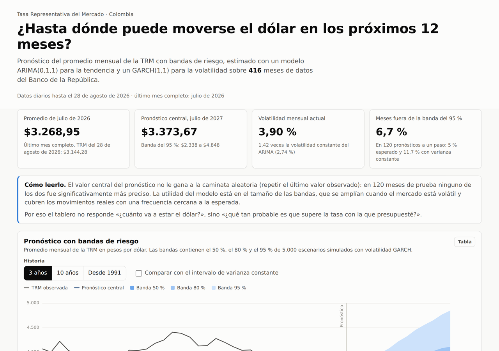

# Series de tiempo de la TRM en Colombia

Análisis de la **Tasa Representativa del Mercado (TRM)** del peso colombiano frente al dólar entre 1991 y 2026 con la metodología Box-Jenkins, desde la exploración de la serie diaria hasta un modelo ARIMA + GARCH para el promedio mensual y su evaluación frente a la caminata aleatoria. El resultado se publica como un tablero de riesgo cambiario que presenta el pronóstico en bandas y la probabilidad de que la TRM supere una tasa de referencia.

**[Ver el tablero →](https://juanhv24.github.io/Time-Series-Colombia/)**

<p align="center">
  
</p>

## Hallazgos principales

| Pregunta | Resultado |
|---|---|
| ¿La serie es estacionaria? | No en nivel ni en logaritmo. El log-retorno sí (ADF p = 0.0000; KPSS p = 0.0701), como corresponde a una caminata aleatoria |
| ¿Tiene estacionalidad? | No en sentido económico. El único patrón periódico es semanal y administrativo: sábados, domingos y festivos repiten la TRM del día hábil siguiente, de modo que el 34.6 % de los retornos diarios son exactamente cero |
| ¿Qué estructura tiene la TRM mensual? | Un ARIMA(0,1,1) con deriva, $X_t = X_{t-1} + 0.3946 + \varepsilon_t + 0.3277\,\varepsilon_{t-1}$. La media móvil no es una oportunidad de predicción, sino la huella del promediado: la agregación temporal de una caminata aleatoria induce una autocorrelación cercana a 0.25 (Working, 1960) y la observada es 0.3087 |
| ¿La volatilidad es constante? | No. Los residuos presentan efectos ARCH (p = 0.0032) que un GARCH(1,1) con innovaciones t captura, con una persistencia de 0.978 |
| ¿Le gana a la caminata aleatoria? | En el valor central no: en 120 pronósticos a un paso la diferencia no es significativa (Diebold-Mariano p = 0.16). En las bandas sí: con GARCH queda por fuera el 6.7 % de los meses frente al 5 % esperado, contra 11.7 % con varianza constante |

Con datos hasta julio de 2026, el pronóstico central para julio de 2027 es de 3373.67 COP/USD, con una banda del 95 % entre 2337.51 y 4848.29, y la probabilidad de que el promedio mensual supere 3500 pesos en ese mes es del 40 %.

## Flujo de trabajo

| Notebook | Pregunta que responde | Contenido |
|---|---|---|
| [`01_exploracion_serie_diaria`](notebooks/01_exploracion_serie_diaria.ipynb) | ¿Cómo se comporta la TRM y qué transformación la vuelve estacionaria? | Calidad de datos, tendencia, patrones por mes y día, descomposición, atípicos y regímenes cambiarios, ADF y KPSS, ACF y PACF |
| [`02_modelado_mensual`](notebooks/02_modelado_mensual.ipynb) | ¿Qué modelo describe la TRM mensual? | Meses completos, elección de la frecuencia, identificación (d, D, ACF y PACF a 48 rezagos), grilla SARIMA, razón de verosimilitud, diagnóstico, efectos ARCH y GARCH(1,1)-t |
| [`03_pronostico`](notebooks/03_pronostico.ipynb) | ¿Sirve para pronosticar? | Prueba a 12 meses, 120 pronósticos a un paso, Diebold-Mariano, calibración de intervalos, estabilidad del MA(1), pronóstico a 12 meses y probabilidad de superar un umbral |

Las funciones que comparten los notebooks y el tablero están en el paquete `trm`, de modo que la serie de trabajo y el modelo final se definen en un solo lugar:

| Módulo | Contenido |
|---|---|
| `datos.py` | Carga de la TRM diaria (archivo local o GitHub), promedio mensual con solo meses completos y log-retornos |
| `pruebas.py` | ADF y KPSS conjuntas, tabla de ACF y PACF, razón de verosimilitud, Diebold-Mariano y métricas de error |
| `modelo.py` | Modelo final ARIMA(0,1,1) + GARCH(1,1)-t, simulación de trayectorias y probabilidad de superar un umbral |
| `evaluacion.py` | Pronóstico estático, pronósticos a un paso con parámetros fijos, calibración de intervalos y estabilidad de la ACF |
| `sitio.py` y `cli.py` | Exportación de los datos del tablero y comandos `trm sitio` y `trm pronostico` |

## Estructura del repositorio

```
Time-Series-Colombia/
├── data/raw/                      # TRM diaria (Banco de la República) e IBR, reservada para trabajo futuro
├── notebooks/                     # Tres notebooks, uno por etapa
├── src/trm/                       # Paquete del proyecto
├── tests/                         # Pruebas del paquete (pytest)
├── docs/                          # Tablero publicado en GitHub Pages
│   ├── index.html
│   ├── assets/                    # Estilos, JavaScript y ECharts
│   └── data/tablero.json          # Datos generados con `uv run trm sitio`
├── reports/figures/               # Figuras exportadas por los notebooks
├── pyproject.toml
└── uv.lock
```

## Reproducibilidad

El entorno se gestiona con [uv](https://docs.astral.sh/uv/) y Python 3.13:

```bash
git clone https://github.com/Juanhv24/Time-Series-Colombia.git
cd Time-Series-Colombia
uv sync                      # crea el entorno e instala el paquete trm
uv run pytest                # pruebas del paquete
uv run trm pronostico        # pronóstico de los próximos 12 meses en la terminal
uv run trm sitio             # regenera docs/data/tablero.json
```

Los notebooks se ejecutan con el kernel del entorno (`.venv`). En Google Colab, la primera celda de cada notebook instala el paquete desde este repositorio y los datos se descargan de GitHub. El tablero se publica con GitHub Pages desde la carpeta `docs/`; para verlo en local basta con `uv run python -m http.server -d docs`.

Para actualizar el análisis con datos nuevos se reemplaza el archivo de la TRM en `data/raw/`, se vuelven a ejecutar los notebooks y se regenera el tablero con `uv run trm sitio`.

## Datos

| Serie | Fuente | Uso |
|---|---|---|
| TRM diaria (COP/USD), 27/11/1991 a 28/08/2026 | Banco de la República, [Portal de Estadísticas Económicas](https://suameca.banrep.gov.co/estadisticas-economicas/catalogo) | Todo el proyecto |
| IBR | Banco de la República | Reservada para trabajo futuro |

Los días sin negociación adoptan la TRM vigente del día hábil inmediatamente siguiente (Banco de la República, 2018), regla que explica los retornos nulos y el patrón semanal de la serie diaria.

## Contexto

El proyecto se desarrolló en la electiva de Series de Tiempo de la Especialización en Analítica Estadística de la Universidad de La Salle y luego se reorganizó por etapas, con un paquete propio y el tablero.

## Referencias principales

- Banco de la República. (2018). *Circular Reglamentaria Externa DODM-146. Asunto 8: Metodología de cálculo de la tasa de cambio representativa del mercado*.
- Bollerslev, T. (1986). Generalized autoregressive conditional heteroskedasticity. *Journal of Econometrics, 31*(3), 307–327.
- Box, G. E. P., Jenkins, G. M., Reinsel, G. C., & Ljung, G. M. (2015). *Time series analysis: Forecasting and control* (5.ª ed.). Wiley.
- Diebold, F. X., & Mariano, R. S. (1995). Comparing predictive accuracy. *Journal of Business & Economic Statistics, 13*(3), 253–263.
- Engle, R. F. (1982). Autoregressive conditional heteroscedasticity with estimates of the variance of United Kingdom inflation. *Econometrica, 50*(4), 987–1007.
- Meese, R. A., & Rogoff, K. (1983). Empirical exchange rate models of the seventies: Do they fit out of sample? *Journal of International Economics, 14*(1–2), 3–24.
- Working, H. (1960). Note on the correlation of first differences of averages in a random chain. *Econometrica, 28*(4), 916–918.

La bibliografía completa de cada etapa está al final de su notebook.

## Autor

**Juan Daniel Hernández Vargas** · [Portafolio](https://juanhv24.github.io/) · [GitHub](https://github.com/Juanhv24)
